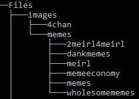

# AutoCrad
> Multi-purpose Discord Bot written in C#

## [Invite AutoCrad to your Discord Server](https://discordbots.org/bot/351821932544393218)

## Features

## Usage example

Invite Command:

8ball Command:

Meme Command:

Kick Command:

Translate Command:

_For more examples and usage, please refer to the [Wiki][wiki]._

## Required Development Setup

* Sub directories within each directory are supported to easily categorise different sources of images. For example, a seperate directory for each source of sub-reddit images
* Create the following directories / files before running the bot from your own machine#
* Should be one joke per line in the jokes.txt file

| Directory          | Purpose     |
| -------------------|-------------|
| Files/images/4chan/| Where the <b>.4chan</b> command images are located |
| Files/images/memes/| Where the <b>.meme</b> command images are located  |
| Files/jokes.txt    | Where the <b>.joke</b> command jokes are located   |

Directory Hierarchy Example:

## Dependencies

* [Discord.Net](https://github.com/RogueException/Discord.Net)

## Meta

Distributed under the [MIT license](https://choosealicense.com/licenses/mit/). See ``LICENSE`` for more information.

Author [@Cr-ad](https://github.com/Cr-ad)

<!-- Markdown link & img dfn's -->
[npm-image]: https://img.shields.io/npm/v/datadog-metrics.svg?style=flat-square
[npm-url]: https://npmjs.org/package/datadog-metrics
[npm-downloads]: https://img.shields.io/npm/dm/datadog-metrics.svg?style=flat-square
[travis-image]: https://img.shields.io/travis/dbader/node-datadog-metrics/master.svg?style=flat-square
[travis-url]: https://travis-ci.org/dbader/node-datadog-metrics
[wiki]: https://github.com/Cr-ad/AutoCrad/wiki
